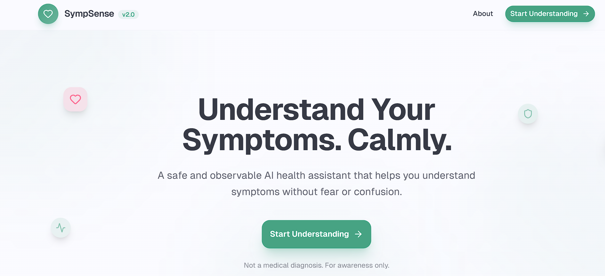

# 🌿 SympSense – Understand Your Symptoms. Simply.
*A Calm, Voice-Friendly Symptom Awareness & Health Insight Web App*

**SympSense** is a responsive, privacy-first web application designed to help users **express, understand, and reflect on their health symptoms** in a calm, structured, and non-intimidating way.

Instead of overwhelming users with medical jargon or fear-driven information, SympSense focuses on **clarity, empathy, accessibility, and awareness**, helping individuals recognize symptom patterns and make **informed decisions about seeking professional care**.

> ⚠️ **Disclaimer:** SympSense is **not a diagnostic tool**. It is designed to support awareness — not replace medical professionals.

---

## 🎯 Project Objective

To build an **accessible, inclusive, and anxiety-reducing health awareness platform** that empowers users to:

- Log and describe symptoms effortlessly  
- Use **voice input** instead of typing (accessibility-first)  
- Receive **AI-powered, non-diagnostic insights**  
- Identify recurring patterns over time  
- Know **when to seek professional or emergency care**  

The goal is **support, not diagnosis** — encouraging mindful and informed health decisions.

---

## 🚀 Live Demo

🔗 **Website:** [Visit the Website](https://symp-sense-lavender.vercel.app/)  
🎥 **Demo Video:** [Watch the Demo](https://youtu.be/BFEh0pCL7rs?si=SeuefI7kABfxo0t2)

---

## 🖥️ Tech Stack

### Frontend
- HTML5  
- CSS3  
- JavaScript  
- TypeScript  
- Vite  

### Styling & UI
- Tailwind CSS  
- Mobile-first, responsive layouts  
- Soft pastel color palette  
- Accessibility-focused typography  

### AI & Intelligence
- **Google Gemini API** – symptom analysis, explanations, and follow-up questioning  

### Voice & Accessibility (Non-Billing)
- **Browser Web Speech API** – voice-based symptom input  

### Architecture
- Frontend-focused, modular design  
- No backend required for core functionality  

### Deployment
- **Vercel**

---

## 🌟 Key Features

### 🩺 Symptom Logging
- Describe symptoms using text or voice  
- Add severity and notes  
- Clean, distraction-free input flow  

### 🎙️ Voice-First Accessibility
- Speak symptoms instead of typing  
- Designed for **low-literacy and rural accessibility**  
- Automatic fallback to text input if voice is unavailable  

### 🧠 AI-Powered Symptom Insights
- Calm, easy-to-understand explanations  
- Non-medical, awareness-focused responses  
- Clear guidance on monitoring vs consulting a doctor  
- Powered by **Google Gemini API**

### 💬 Intelligent Follow-Up (Cross-Questioning)
- AI asks simple follow-up questions such as:  
  - “Since when are you feeling this?”  
  - “Is the pain mild, moderate, or severe?”  
- Improves clarity without overwhelming the user  

### 🚨 Emergency Awareness & Guidance
- Detects potentially concerning symptoms (e.g., severe chest pain)  
- Displays emergency warnings and local emergency numbers (India: **112 / 108**)  
- Encourages immediate medical attention when required  

### 📊 Pattern Awareness
- Helps users notice recurring or clustered symptoms  
- Encourages better long-term self-awareness  

### 🧘 Calm & Accessible UI
- Designed to reduce health anxiety  
- Soft gradients and rounded cards  
- Clear visual hierarchy  
- Fully mobile-friendly and responsive  

### 🔐 Privacy-First by Design
- No forced login  
- No unnecessary personal data collection  
- Voice input processed locally in the browser  
- Full user control over entered information  

---

## 📸 Screenshots

### 🌿 Home / Landing Page


### 🩺 Symptom Input & Voice Logging


### 🧠 AI Insight & Guidance View


### 🚨 Emergency Awareness Flow


---

## 📁 Folder Structure

```
.
├── .env
├── .gitignore
├── screenshots/
│   ├── landing.png
│   ├── symptom-input.png
│   ├── insight-view.png
│   └── emergency-flow.png
├── index.html
├── package.json
├── package-lock.json
├── postcss.config.js
├── tailwind.config.ts
├── tsconfig.json
├── vite.config.ts
└── README.md   # Project documentation

```

---

## ⚙️ Setup Instructions

### 1. Clone the Repository

```
git clone https://github.com/<your-username>/symp-sense.git
cd symp-sense
```

2. Run Locally

```
npm install
npm run dev

```

Deploy the dist folder on Vercel, Netlify, or GitHub Pages.

---


👥 Contributors

| Name | Role |
|------|------|
| @aadya2901 | Leader, AI Integration, Landing Page, Deployment, Documentation |
| @iam-anish15 | UI Design, Styling, Frontend Enhancements |
| @ananyamishra13 | Pages & Components Development, Output Panel |


---

## 🛣️ Future Enhancements & Roadmap

### ✅ Already Implemented
- Multilingual support (English and regional language support)  
- Voice-based symptom input for improved accessibility  

### 🚧 Planned Enhancements
- Medication reminders and follow-up alerts  
- Persistent symptom history tracking across sessions  
- Optional backend integration for secure long-term data storage  

### ⚠️ Deferred (Billing-Dependent Enhancements)
- Nearby hospital and doctor recommendations using map-based services  
  *(Planned using Google Maps API; deferred to avoid billing requirements during the hackathon phase)*

---

## 🤝 Contributing

We welcome contributions, improvements, and bug fixes:

1. Fork the project  
2. Create your feature branch (`git checkout -b feature/YourFeature`)  
3. Commit your changes (`git commit -m 'Add your feature'`)  
4. Push to the branch (`git push origin feature/YourFeature`)  
5. Open a Pull Request  

---

📝 License

This project is open source under the MIT License. Use it for personal or educational purposes.

---

💬 Final Note

“Awareness is the first step toward better health.” 🌱

SympSense is built to support reflection, not fear — offering users a gentle, informative way to listen to their bodies and make mindful health choices.

---


