# 🌿 SympSense — Care. Clarity. Confidence in Every Symptom

*A safe, observable, and human-centered AI system for symptom awareness*

---

## 💡 Overview

**SympSense** is a privacy-first, AI-powered health awareness platform designed to help users **understand symptoms with clarity, calm, and confidence**.

Instead of overwhelming users with medical jargon or generic chatbot replies, SympSense delivers **structured, explainable, and safe AI insights**.

---

## 🎥 Demo Preview

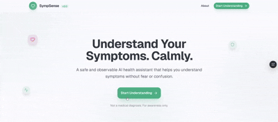

A quick walkthrough of SympSense — from symptom input to clear, structured AI guidance.

---
### ✨ Core Focus

- 🧠 Clarity over confusion  
- 🧘 Calm over anxiety  
- 🛡️ Trust over blind AI responses  

> ⚠️ **Disclaimer:** SympSense is not a diagnostic tool. It provides awareness and guidance, not medical advice.

---

## 🎯 Project Objective

To build a **safe, transparent, and emotionally-aware AI health assistant** that empowers users to:

- Understand symptoms in a structured way  
- Track health patterns over time  
- Receive calm, non-alarming guidance  
- Know when to seek professional help  
- Trust AI through observability and transparency  

👉 The goal is **awareness and reassurance — not diagnosis**

---

## 🚀 Live Demo

🔗 [Visit the Website](https://symp-sense-lavender.vercel.app/) <br>
🎥 [View the Demo](https://youtu.be/KfFnP6siiIs?si=1d2OvQAU1ObEXlV6)

---

## 🖥️ Tech Stack

### Frontend
- TypeScript  
- HTML5  
- Tailwind CSS  
- Vite  

### AI & Intelligence
- Google Gemini API  

### Observability
- Datadog (logging, monitoring, safety signals)  

### Voice Interaction
- Web Speech API  

### Deployment
- Vercel  

---

## 🌟 Key Features

### 💬 SympAI — Symptom Understanding Engine
- AI-powered symptom analysis  
- Calm, empathetic responses  
- Easy-to-understand explanations  

---

### 🧠 Structured Health Insights
- Severity level (Low / Moderate / High)  
- Confidence score  
- Recommended next steps  

👉 No more long, confusing AI answers

---

### 🕒 Symptom Timeline & Pattern Tracking
- Log symptoms over time  
- Detect recurring patterns  
- Enable long-term awareness  

---

### 📊 Observability Dashboard (Core Innovation)
- Monitor AI responses in real time  
- Track latency, reliability, and safety signals  
- Ensure system transparency  

👉 Turns AI into a **visible, accountable system**

---

### 🚨 Safety & Emergency Detection
- Detect high-risk symptoms  
- Provide escalation guidance  
- Built-in disclaimers  

---

### 🎙️ Voice & Accessibility
- Voice-based symptom input  
- Multilingual support  
- Inclusive design for all users  

---

### 🧘 Calm & Human-Centered UX
- Soft pastel UI  
- Anxiety-reducing interactions  
- Emotionally aware microcopy  

---

## 📸 Platform Walkthrough

### 🏠 Landing Experience  
“Understand Your Symptoms. Calmly.”

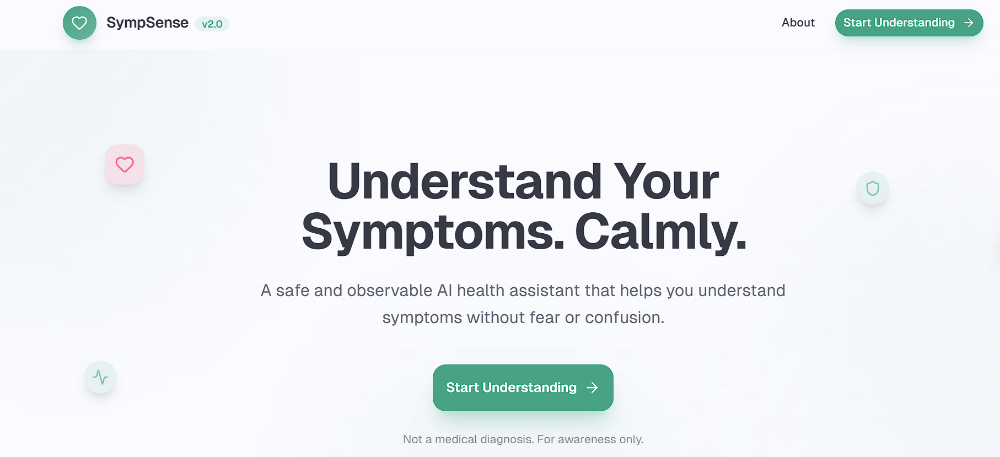

A calm, minimal entry point designed to reduce anxiety and guide users with clarity from the very first interaction.

---

### ⚙️ How SympSense Works  

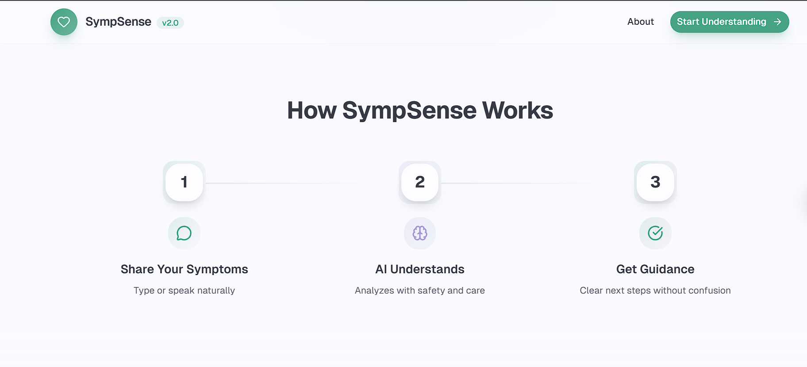

A simple, intuitive 3-step flow:
- Share your symptoms  
- AI processes with care  
- Receive clear, structured guidance  

---

### 💬 Symptom Input

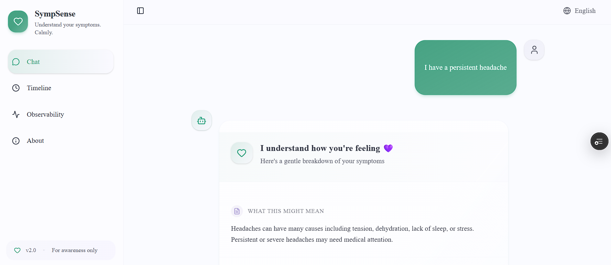

Users can describe symptoms naturally using text or voice — no rigid forms or medical jargon required.

---

### 🧠 AI Response 

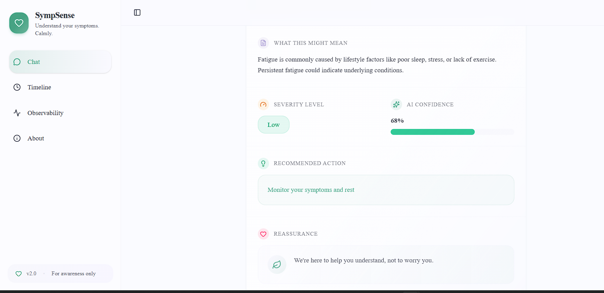

Structured and explainable AI output including:
- Clear explanation  
- Severity level  
- Confidence score  
- Recommended actions  

👉 Designed to inform without overwhelming or alarming users

---

### 🔍 Transparency Layer  

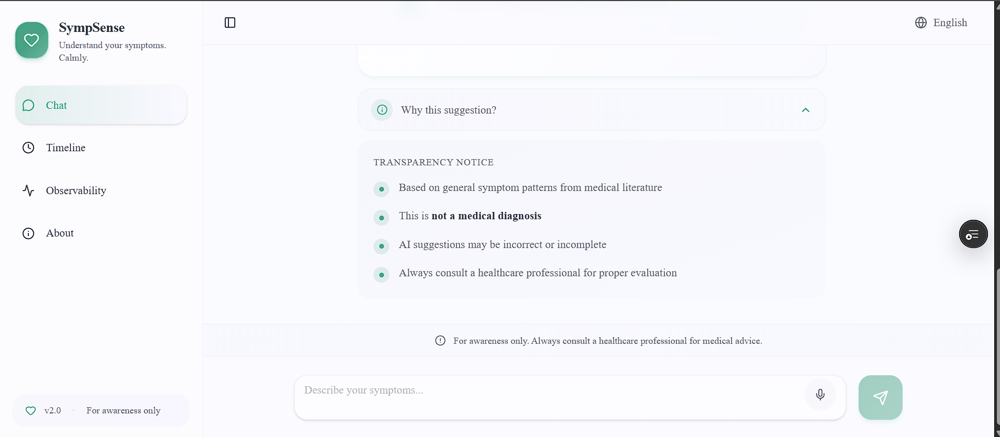

Provides visibility into AI reasoning:
- Why a response was generated  
- System limitations  
- Safety disclaimers  

👉 Builds trust through explainability and accountability

---

### 🕒 Symptom Timeline  

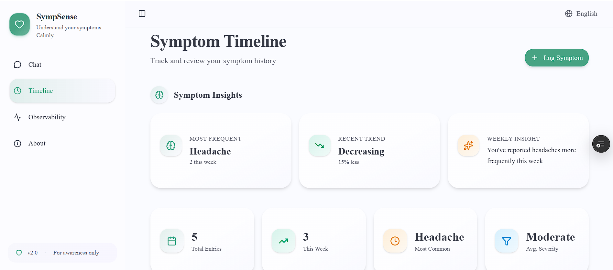

Track symptoms over time to identify recurring patterns and improve long-term health awareness.

---

### 📊 Health Insights Dashboard  

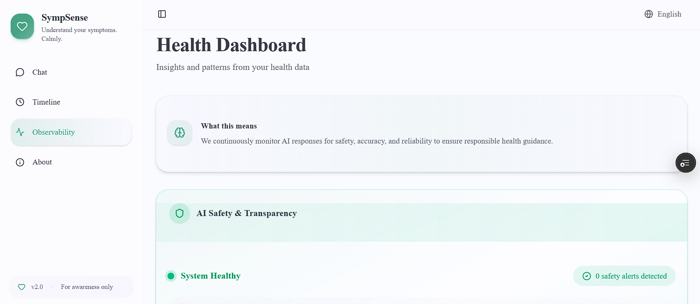

Visual insights into user health data:
- Trends and patterns  
- Most frequent symptoms  
- Weekly summaries  

---

### 🌍 Multilingual Support  

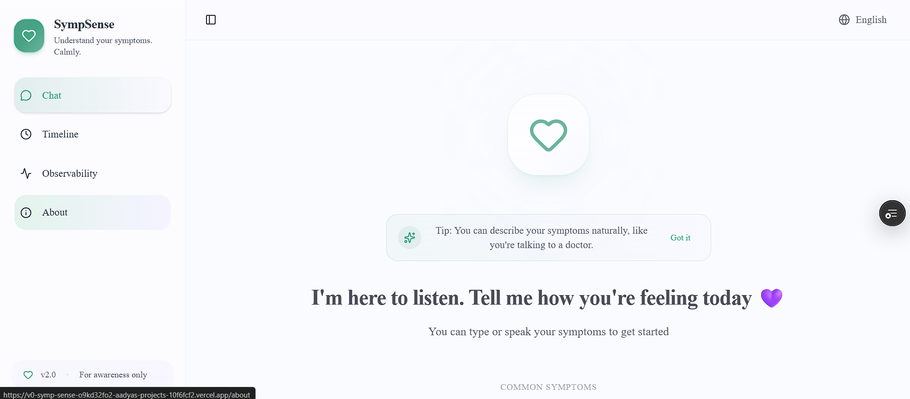
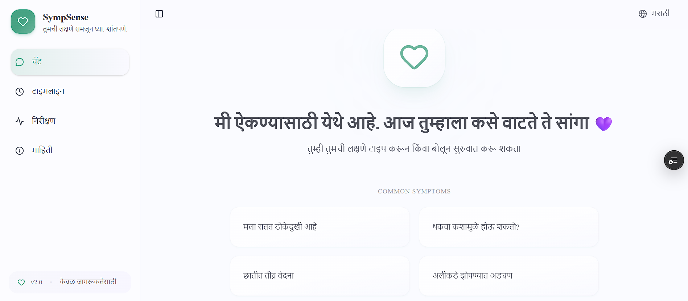
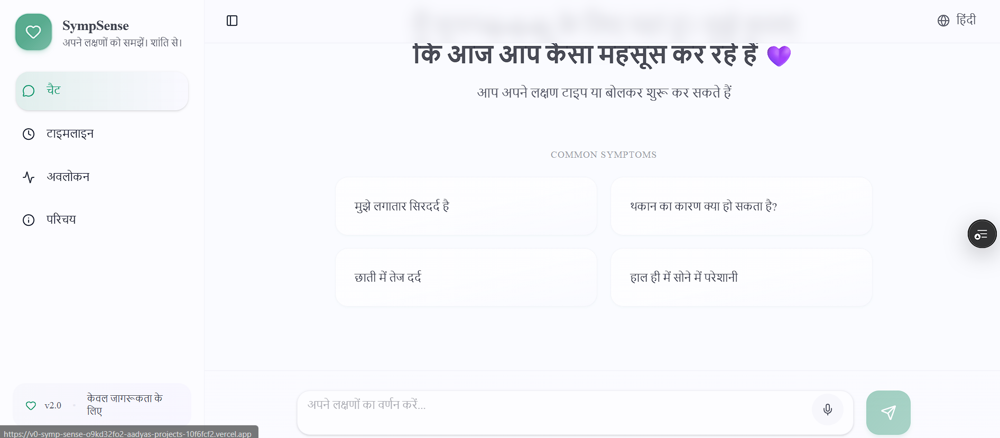

Supports multiple languages to ensure accessibility and inclusivity across diverse users.

---

## 🌟 Why Choose SympSense

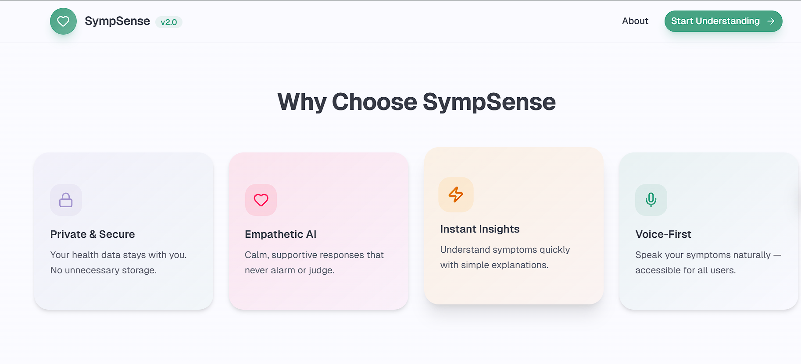

What makes SympSense different:

- 🛡️ Privacy-first — No unnecessary data storage  
- 💬 Calm AI — Designed to reduce anxiety, not create it  
- ⚡ Structured insights — No long, confusing responses  
- 🔍 Explainable outputs — Know *why* AI says something  
- 📊 Observable system — Real-time safety and reliability monitoring  

👉 From a black-box chatbot → to a transparent, trustworthy system

---

### ⚠️ Safety & Disclaimer  

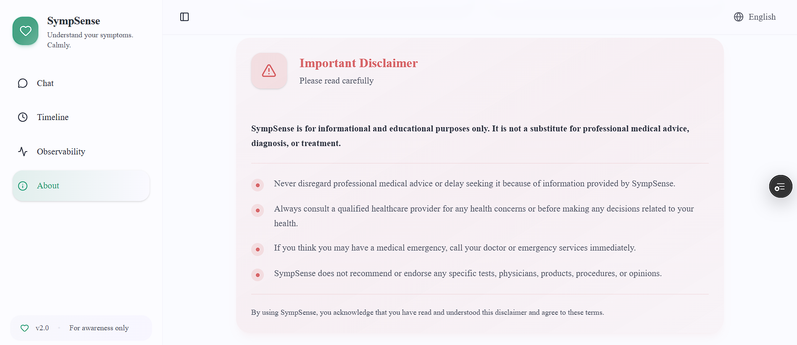

Clear and responsible messaging to ensure:
- Awareness, not diagnosis  
- Safe usage of AI  
- Encouragement to seek professional care  

---

## 👥 About Us

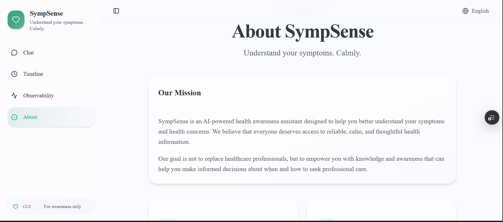

SympSense was created to rethink how people interact with health information.

Instead of overwhelming users with complex or alarming outputs, we built a system that prioritizes:

- 🧠 Clarity — Simple, structured understanding  
- 🧘 Calmness — Emotionally aware, reassuring responses  
- 🛡️ Trust — Transparent and responsible AI behavior  

👉 A human-centered AI that supports users — not replaces healthcare.

---
## 🔄 Finale Round Improvements

We evolved SympSense from a simple AI tool into a **responsible, production-like system**:

- 🔄 Redesigned UI for calm and clarity  
- 🧠 Introduced structured AI outputs  
- 📊 Built observability layer (core USP)  
- 🚨 Added safety + emergency detection  
- 🎨 Improved emotional tone and UX  

👉 Focus shifted from **features → trust, usability, and responsibility**

---

## 📁 Folder Structure

```
.
├── src/
├── public/
├── screenshots/
├── index.html
├── package.json
├── vite.config.ts
└── README.md
```

---

## ⚙️ Setup Instructions

```
git clone https://github.com/<your-username>/symp-sense.git
cd symp-sense
npm install
npm run dev
```

---

## 🌍 Deployment (Vercel)

- Connect GitHub repository  
- Select framework (Vite / Next.js depending on setup)  
- Deploy instantly  

---

## 👥 Contributors

| Name           | Role                                      |
|----------------|-------------------------------------------|
| Aadya Patel    | AI Integration, Architecture, Deployment  |
| Anish Kushwaha | UI/UX Design, Frontend                    |
| Ananya Mishra  | Components, Interface Development         |

---

## 🛣️ Future Scope

### ✅ Planned

- Long-term health analytics  
- Regional language expansion  
- Personalized insights  

### 🚧 Advanced

- Hallucination detection  
- Confidence calibration  
- Clinician dashboards  

---

## 📝 License

This project is licensed under the **MIT License**. 

---

## 💬 Final Thought

> “In health, clarity matters more than information.” 🌱  

SympSense is built to help users **feel informed, calm, and in control** — turning AI into a trusted companion, not a source of fear.
